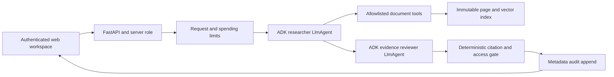

# Boundary architecture

Boundary is an intermediate document-intelligence portfolio project for researching a fixed collection of cricket rulebooks included in the repository under the user's publication authorization. It demonstrates a pattern relevant to policy, compliance and operational knowledge work: retrieve evidence, distinguish governing scopes, review a proposed answer, and release only a checked response. It is not a production compliance decision system.

## Request path

A durable audit preflight must succeed before model dispatch. After the workflow completes, the final metadata append must be fully written and fsynced before the response is released; audit failure withholds the response.

The ADK SequentialAgent runs two distinct model agents. The researcher can call `list_sources`, `search_documents`, and `read_evidence`. A separate reviewer sees the proposed answer and retrieved evidence and checks whether each claim is supported and scoped correctly. Both agents use the same configured Gemini model. The second agent is a separate inference step; it does not provide statistical independence from the first model's failure modes.

The researcher callback constrains Gemini's function selection by successful tool state: list sources, search, then read returned evidence before finalization. Near the budget boundary it prevents another search and requests structured finalization, reserving a separate model call for the reviewer. The configured default is eight total model calls, with 900 output tokens per call and a 7,200-token aggregate output allowance. These controls improve the required tool path; the final gate still rejects any claim citing a page that was not read. A model's compliance and answer quality must be measured in the live evaluation.

Before each researcher dispatch, the read declaration's string-item enum is restricted to reauthorized IDs issued in this invocation. The callback copies the declaration for that request, supports both installed SDK schema representations, omits an unavailable read declaration, and fails closed above 256 IDs. The dynamic schema is included in input estimation. Google's [function-calling schema reference](https://docs.cloud.google.com/gemini-enterprise-agent-platform/reference/models/function-calling) supports string enums and array-item schemas; the application still validates actual tool arguments and does not treat provider adherence as an authorization boundary.

A callback can intercept the researcher's structured finalization once when cited pages were issued during this invocation and authorized, but remain unread. It permits one actual `read_evidence` call for the exact missing ID set only if a read, revised finalization and separate reviewer still fit. IDs may come from any search in the current invocation, which supports comparisons; earlier invocation IDs cannot qualify. Invalid, late or unsuccessful repairs remain subject to the unchanged release gate. The callback never marks evidence read itself.

The deterministic release gate checks structure, reviewer verdict, current-request evidence IDs, allowed source IDs, and required claim citations. These checks establish citation integrity, not semantic entailment. The model reviewer and a separate source-based assessment address semantic support; neither guarantees correctness. Record whether the separate assessor is an agent or a human. Agent review is not human approval.

`GovernedGemini` explicitly disables ADK's combined schema/tool capability so research always uses `set_model_response`. Forced researcher tool calls use text/plain without a response schema; the separate reviewer keeps its JSON schema. This removes an environment-dependent ADK branch that caused native/cloud HTTP 400 despite a working local dotenv process. Clean-process tests cover both Vertex environment-flag values without changing actual Vertex routing; see `REVIEW_CAPABILITY_ADAPTER.md`.

Historical runs exposed supported but incomplete answers that passed model review. The resumed implementation adds required question-part assessments mapped to strict zero-based draft claim indices, explicit conditions/exception preservation, and unsupported absence-claim checks. Answered responses require nonempty supported coverage and valid mappings to cited, read evidence. Justified insufficient-evidence responses use a separate compatible path. The schema and gate enforce consistency; identifying all question parts and judging their support remain model decisions. This change requires new live measurement and does not retroactively improve historical results. See [the quality contract](QUALITY_CONTRACT.md).

## Corpus and retrieval

The three included, user-authorized PDFs remain immutable ingestion inputs:

| Source ID | Supplied document | Scope |
|---|---|---|
| `junior_2025` | September 2025 junior cricket rules | Multiple age divisions and formats |
| `mcc_2022` | MCC Laws, 2017 Code, 3rd edition 2022 | General Laws in the supplied edition |
| `usig_2023` | US Ismaili Games cricket tournament rules | Competition-specific; effective date unspecified |

`usig_2023` is an identifier; the suffix is not a confirmed rule effective date. The source manifest carries the actual display label. No answer should silently promote a competition-specific rule to a universal current rule.

The index stores stable source/page evidence IDs, source hashes, extracted text, access roles and optional dense vectors. The live target uses real Vertex `gemini-embedding-001` embeddings and local hybrid retrieval over a fixed JSON snapshot. This small corpus does not require a separate vector database. The explicit lexical mode is an offline/debug option, not equivalent to the live vector path. Query embeddings use `RETRIEVAL_QUERY`; document embeddings use `RETRIEVAL_DOCUMENT`. Generation and embeddings can use different Vertex regions.

Each search retains the current user question before the model's refinement. The refinement defaults to 1,200 characters; the combined query defaults to 7,500 characters and supports at most 10,000. Overflow fails explicitly, and query embedding rejects provider truncation. Authorized candidates receive a weighted score from normalized BM25 (65%) and normalized cosine similarity (35%), using one query embedding. These are development implementation choices, not validated optimal weights. The model sees a query-focused 700-character preview instead of an arbitrary page prefix; final source panels still show the full page. Ranking and previews do not establish semantic support.

Each ranked hit also exposes up to two valid adjacent pages from the same source with bounded context previews. A preview selects an exact requested dotted provision when present, otherwise the previous page's tail or next page's head. These references are issued but not automatically read, and have no invented similarity score. All distinct returned text fragments are charged atomically; identical fragments can deduplicate, while overlapping different windows may conservatively count twice. The read tool accepts exact IDs issued by any search in the current invocation and checks the entire batch before recording evidence. Malformed, unissued, unauthorized or missing pages receive a generic structured error with only authorized previously issued suggestions. One ordinary corrective read is permitted per invocation before safe finalization; a new search cannot reset the allowance, and exhaustion cannot reopen formatter repair. Budget and audit failures still fail closed.

Snippet matching distinguishes integers from dotted references and emphasizes ordered numeric query phrases. An offline probe did not justify changing BM25 ranking, so ranking tokenization and hybrid weights remain unchanged. The reviewer receives the current question explicitly through refreshed, quoted untrusted state as well as the conversation context. These changes address observed failure paths; their effectiveness requires live measurement.

The lexical channel uses the raw question and refinement without the embedding query's instructional wrapper. When explicit source IDs already constrain retrieval, tokens from those selected sources' ID, title and competition are removed from lexical ranking and snippets. This prevents rare source-name and wrapper terms from overpowering the topic. Substantive age/format qualifiers remain, and the full combined Vertex embedding query is unchanged. This is a general metadata-based rule, not an answer or page lookup.

Index integrity is checked against its snapshot metadata. Source allowlists apply before retrieval and again at release. Source content is untrusted data and cannot expand tool permissions, alter roles, or change the model budget.

## Boundaries and controls

- The browser supplies a question and optional opaque session ID; it cannot choose a role or a filesystem path.
- The application access token uses `X-App-Token`, allowing Cloud Run's IAM identity to use `Authorization` independently. The local backend may also accept Bearer authentication.
- Tokens stay in tab memory, not browser local/session storage. Server sessions are bound to the authenticated principal.
- The user interface displays the final reviewed response, never a streaming research draft.
- Model and tool calls have explicit limits. Request timeouts and the application's conservative cost accounting stop additional work; billing budgets/estimates are not hard Google billing caps.
- Default audit records contain request IDs, stages, durations, counters and status, without prompts, answers or source passages. An audit-write failure blocks a successful release.
- The repository includes the source PDFs for reproducible ingestion, but the running application does not serve PDF files. Authenticated citations display bounded evidence through the API; the generated index and operational artifacts remain private.

## Deployment shape

Local development uses FastAPI plus static HTML/CSS/JavaScript. No frontend build chain or external font/CDN request is needed. Cloud Run hosts the same app behind IAM, with an immutable prebuilt private index. Application configuration and credentials are external to git. A private storage bucket records the index provenance; the application runtime does not need to mutate the corpus.

Sessions and app-level limits are process-local unless explicitly backed by durable storage. Cloud Run deployment must therefore remain a constrained single-user demo; horizontal scaling, persistent conversations, multi-tenant roles, and globally atomic budget accounting are out of scope. A production version needs a durable session store, per-user identity and authorization, centralized rate/cost accounting, stronger operational monitoring, and a larger independent evaluation.

## Evaluation evidence

The development set contains 20 cases and 23 requests including prior-turn context. It covers single-source facts, cross-document disagreement, follow-ups, missing information, scope, adversarial instructions, and access requests. Automatic checks verify response structure, expected source/page coverage and citation linkage. Source-review rubrics assess factual support and scope with the reviewer identity recorded; no regex score is labeled semantic correctness. Root's final acceptance set is separate and should be run after the implementation freeze. If it informs changes, its status must be described as a regression/acceptance set rather than untouched holdout evidence.

The pre-resumption paced deployed acceptance/regression result was a material design limitation: 5 of 10 final cases passed source assessment, with three available answers failing correctness or completeness and two outcomes unavailable. A successful browser sample and perfect native tool-order trajectory score demonstrate narrower properties and must not be presented as semantic accuracy.

The resumed frozen quality-v3 cloud regression also passed 5/10 final cases, with a different failure mix: one available answer omitted junior section-level format/team scope, and four final cases were unavailable with provider resource-exhaustion errors. The underlying capacity or quota cause was not established. Ten of eleven planned turns were dispatched; a failed setup prevented its dependent follow-up. The [release source review](REVIEW_CLOUD_QUALITY.md) binds those results to the deployed image and corpus/case hashes. These measured limitations remain despite the added question-part checks, context previews and constrained read declarations.
