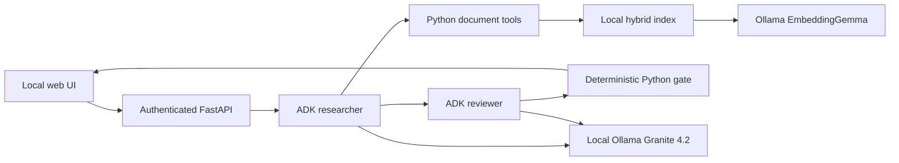

# Boundary: local ADK architecture

Boundary is an intermediate document research prototype. Google ADK coordinates the workflow; Ollama runs Granite 4.2 locally for two model roles. EmbeddingGemma builds/query-embeds a local index. There is no hosted inference fallback in the local profile.

The native `adk web` development interface invokes the governed ADK export directly. It is loopback-only operator tooling; the custom web UI adds an application token, owner-bound sessions, and a final-answer-only presentation.

## Agent responsibilities

An ADK `SequentialAgent` runs the researcher, reviewer, and gate in order. Both model agents use the same local Granite 4.2 weights with different instructions. Separate invocations do not make their errors statistically independent. ADK exposes typed Python tools and manages event/session state; application code implements retrieval and release decisions.

The researcher lists authorized sources, searches document pages, and reads exact evidence IDs before proposing claims. The three document tools remain `list_sources`, `search_documents`, and `read_evidence`. The reviewer checks coverage of the original question, factual support, source scope, conditions, and unsupported absence claims. It receives a bounded current-turn pack of the draft and reauthorized pages actually read; prior user questions serve only as untrusted follow-up context. Research transcripts and search snippets are excluded. Each claim must be supported by its attached citations, not by an uncited page elsewhere in the pack. The deterministic gate checks typed output, review decision consistency, claim citations, current-invocation reads, source permissions, and scope. It fails closed on invalid citations or rejected review. Both agents use ADK's internal typed formatter; the reviewer may correct one invalid formatted decision within the existing eight-model-call run limit. Its validation feedback is private, bounded and cleared per invocation; it has no document-retrieval tools of its own.

A current-invocation evidence ID allowlist constrains the researcher's outbound read-tool schema; server-side checks remain authoritative. Search previews and previous-turn citations do not count as current evidence reads. One bounded repair can request missing reads before finalization when budget permits. Tool errors never silently mark evidence read. Multi-turn state is cleared and re-grounded for each request.

For Ollama, formatter declarations use fully expanded canonical Pydantic schemas on request-local copies before the first advertised use, preserving constraints that SDK introspection can omit; exact Pydantic validation remains authoritative. Forced research phases expose only the required tool, and malformed tool calls consume the bounded budget.

Model/adapter compatibility is covered separately from factual quality: successful tool calls and JSON parsing are not evidence that a cited claim is correct. The application must still compare actual answers with the supplied pages. Safe refusals on answerable questions count as incomplete behavior in evaluation.

## Documents and retrieval

The unchanged corpus has 156 pages across three published PDFs: `junior_2025` (52 pages), `mcc_2022` (79), and `usig_2023` (25). The last identifier does not establish a source effective date. All answers must preserve the supplied edition and competition/age/format scope.

PDFs are immutable inputs. A separately generated, hashed local index contains source hashes, stable one-based page IDs, text, role allowlists, and EmbeddingGemma vectors. It never reuses Vertex vectors. The embedding path uses bounded inputs and rejects truncation, invalid dimensions, and non-finite results. Read the ingestion implementation for the exact chunk-and-pool contract recorded in each local snapshot.

Retrieval combines normalized BM25 (65%) and cosine similarity (35%) over authorized pages. These are development choices, not claimed optimal weights. The original question is preserved alongside bounded search refinement. Source-name tokens are handled separately from substantive question terms. Query-focused previews and adjacent-page references help the researcher locate evidence; the gate still requires actual reads. A small fixed corpus does not need a separate database service.

## Local boundaries

- Generation and embedding endpoints are loopback-only. The local profile does not use Google credentials, OpenAI keys, or hosted inference.
- The normal web UI uses a private application token kept in tab memory, server-assigned roles, and owner-bound, bounded in-memory sessions.
- Evidence is untrusted content: documents cannot alter permissions, tools, budgets, or release policy.
- Model/tool/input/output/evidence and time limits bound the work. Local inference consumes machine resources even though there are no per-token API fees.
- Default durable audit logs contain metadata, not questions, answers, passages, or secrets. Audit write failures block successful release. Detailed test responses are private artifacts.
- Local ADK sessions and the application history are temporary, single-workspace facilities, not enterprise multi-user identity or durable storage.

## Validation and limitations

See [RESULTS_LOCAL.md](RESULTS_LOCAL.md) for current executed checks and [REVIEW_LOCAL_OLLAMA.md](REVIEW_LOCAL_OLLAMA.md) for independent review when complete. Offline authorization/contract tests, native ADK trajectories, source-based semantic review, and browser checks establish different properties. Do not conflate them.

A gate can establish citation integrity and permissions, but cannot guarantee semantic correctness. Smaller local models may be slow or produce malformed/incomplete outputs. Context limits, PDF extraction and missing parent-section context can affect quality. This is a learning/portfolio system, not a production decision engine.

[Historical architecture](HISTORICAL_CLOUD_ARCHITECTURE.md) preserves the prior cloud experiment. Existing cloud resources were not retired by changing local code. The original RAG and policy/KPI repositories remain untouched.
